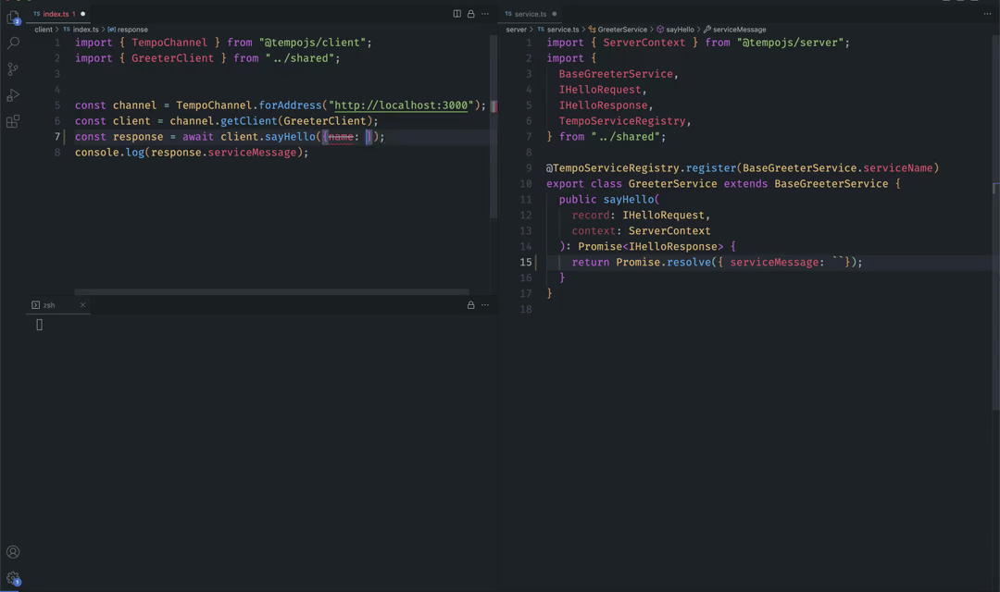

<a href="https://tempo.im/" target="_blank" rel="noopener">
  <picture>
    <source media="(prefers-color-scheme: dark)" srcset="./assets/banner.png" />
    
  </picture>
</a>

  <h1>Tempo</h1>
   <h3>Don't miss a beat. Real-time, end-to-end typesafe APIs.</h3>
  
  
   
  
   
   
  <figure>
  
    <figcaption>
      

        The client and server above share type definitions through <a href="https://github.com/betwixt-labs/bebop">Bebop</a>
      

    </figcaption>
  </figure>

 

## Intro

Tempo allows you to easily build & consume low-latency, cross-platform, and fully typesafe APIs

:warning: **This project is in early public preview, not intended for production use, and we actively encourage community feedback to help shape its development.**

### Features

- 🧙‍♂️&nbsp; Full static typesafety & autocompletion on the client/server, for inputs, outputs, and errors.
- 🐎&nbsp; Snappy DX - cross-platform code generation powered by [Bebop](https://github.com/betwixt-labs/bebop), no ceremony, or complex build pipelines.
- 🍃&nbsp; Light - Tempo has zero deps and a tiny footprint on both the client and server.
- 👀&nbsp; Check out the examples in the [./examples](./examples)-folder
- 🌗&nbsp; Opinionated - the Tempo abstraction allows you to write the same code in any language.
- ☁️&nbsp; Runs everywhere - browsers, serverless platforms, and on bare metal.

**👉 For more information check out the [wiki](https://github.com/betwixt-labs/tempo/wiki). 👈**

### Goals

- 🌐&nbsp; Ensure compatibility with popular serverless backends, such as Next.js, AWS Lambda, and others, to maximize flexibility and adaptability.
- 📈&nbsp; Maintain the high quality and performance of the framework by regularly updating and optimizing the codebase.
- 🤝&nbsp; Establish strong partnerships with serverless platform providers to better integrate and support Tempo.
- 🛠️&nbsp; Implement comprehensive testing and continuous integration to guarantee the reliability and stability of the framework.
- 🌟&nbsp; Attract and retain a dedicated community of developers and contributors, focused on the continuous improvement and long-term success of Tempo.
- 🔧&nbsp; Enhance the developer experience (DX) by creating and improving tooling for both Tempo and Bebop, as well as integrating with existing developer tools like Postman.

### Progress

| Language/Framework    | Status                   | Server Backends    | Progress                                                                            |
| --------------------- | ------------------------ | ------------------ | ----------------------------------------------------------------------------------- |
| Typescript/Javascript | 🚧 Under construction 🚧 | Cloudflare Workers | [✅](https://github.com/betwixt-labs/tempo/tree/main/typescript/packages/cf-router) |
|                       |                          | NodeJS HTTP        | [✅](https://github.com/betwixt-labs/tempo/tree/main/typescript/packages/node-http) |
|                       |                          | NextJS             | ❌ Not started                                                                      |
|                       |                          | Deno               | ❌ Not started                                                                      |
|                       |                          | ...                | ❌ Not started                                                                      |
| C#                    | 🚧 Under construction    | ASP.NET            | 🚧 Under construction                                                               |
|                       |                          | ...                | ❌ Not started                                                                      |

## 🌟 Join the Tempo Community

We welcome and appreciate any questions, comments, or suggestions you may have! We encourage you to participate in our growing community, and there are several ways you can get in touch with us:

- 💬&nbsp; Start a conversation on our [GitHub Discussions](https://github.com/betwixt-labs/tempo/discussions) board.
- 🎮&nbsp; Join our [Discord server](https://discord.gg/Pn8BwUnP25) to chat with fellow developers and maintainers.
- 🐞&nbsp; If you encounter any issues or have a feature request, please [open an issue](https://github.com/betwixt-labs/tempo/issues) on GitHub.

We look forward to hearing from you and working together to make Tempo even better! 🚀
